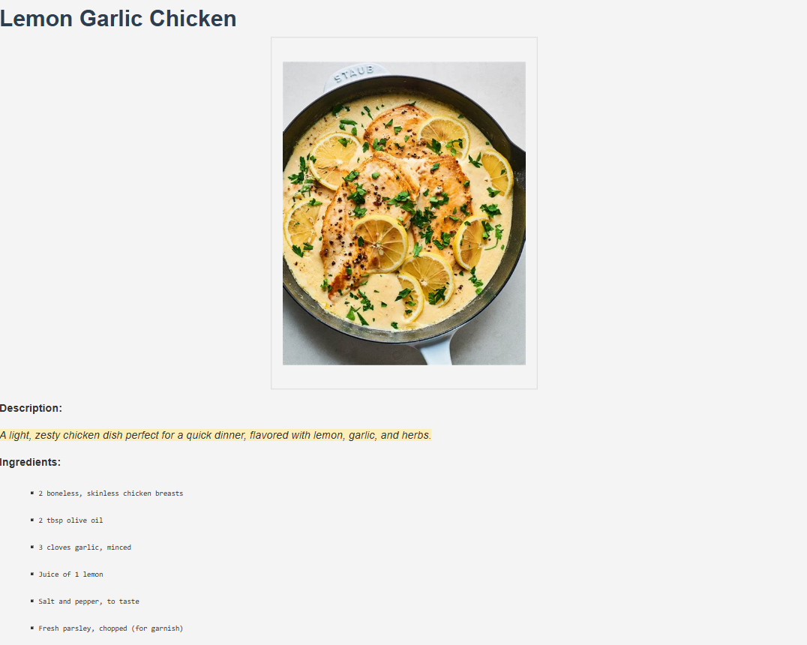

# Recipe App 🍲

Welcome to the **Recipe App**! This Django-based web application lets users add, view, update, and delete recipes. It's an ideal solution for storing and managing your favorite recipes in one place, complete with descriptions, ingredients, and cooking instructions.

## Features

- **CRUD Operations**: Create, Read, Update, and Delete recipes with ease.
- **Recipe List View**: See all your recipes in a clean list format.
- **Recipe Detail View**: Click on a recipe to see full details.
- **Contact Page**: Reach out with questions or support requests.

## Demo

- **Home**: Displays a welcome message with a link to navigate to the recipe list.
- **Recipe List**: View all recipes.
- **Recipe Detail**: Detailed page for each recipe.
- **Contact Page**: Form for user inquiries and messages.

## Screenshots

  
  

## Getting Started

To set up this project locally, follow these instructions:

### Prerequisites

- **Python 3.x**
- **Django** installed (refer to the `requirements.txt` for other dependencies)

### Installation

1. **Clone the repository**:

   ```bash
   git clone https://github.com/yourusername/recipe_app.git
   cd recipe_app

2. **Create a virtual environment**:

    ```bash
    python -m venv env
    source env/bin/activate  # On Windows use `env\Scripts\activate`

3. **Install dependencies**:

    ```bash
    pip install -r requirements.txt

4. **Apply migrations**:

    ```bash
    python manage.py migrate

5. **Create a superuser to access the admin panel**:

    ```bash
    python manage.py createsuperuser

6. **Run the server**:

    ```bash
    python manage.py runserver

7. Open your browser and navigate to http://127.0.0.1:8000 to see the application.


## Usage

- **Home**: Go to [http://127.0.0.1:8000](http://127.0.0.1:8000) to see a welcome message and navigate to the recipes list.
- **Admin Panel**: Log in at [http://127.0.0.1:8000/admin](http://127.0.0.1:8000/admin) to manage recipes and messages.
- **Recipes CRUD**: Use the buttons in the recipe list and detail pages to create, view, update, and delete recipes.
- **Contact**: Access the contact page from the home page or URL and fill out the form to submit an inquiry.

